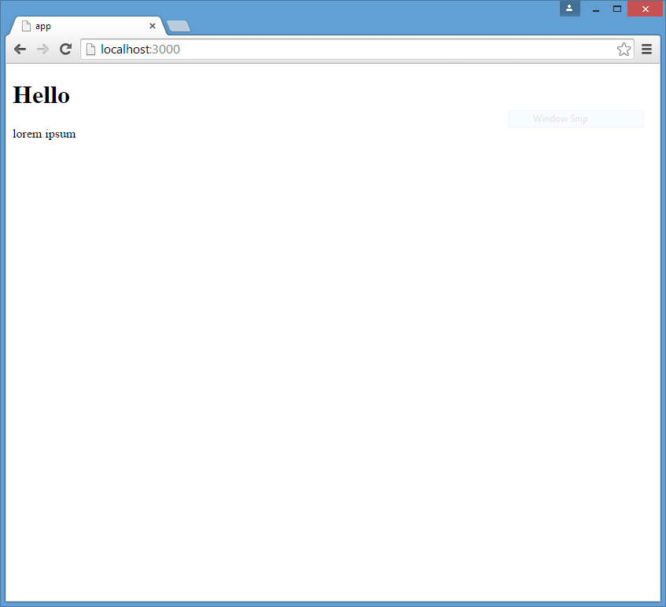
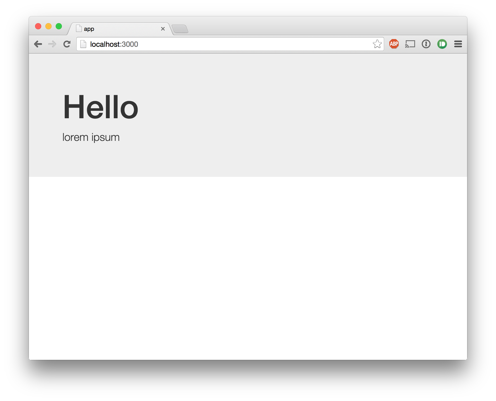

JSPM CSS Win
============

JSPM CSS loader does not work in this project on Windows. On OS X it does.

1.  go to jspmcss
2.  run 
	npm install
	cd public
	jspm install
	cd ../
	node app.js
3.  go to http://localhost:3000/

On Windows it looks like this:

On OS X like this:
